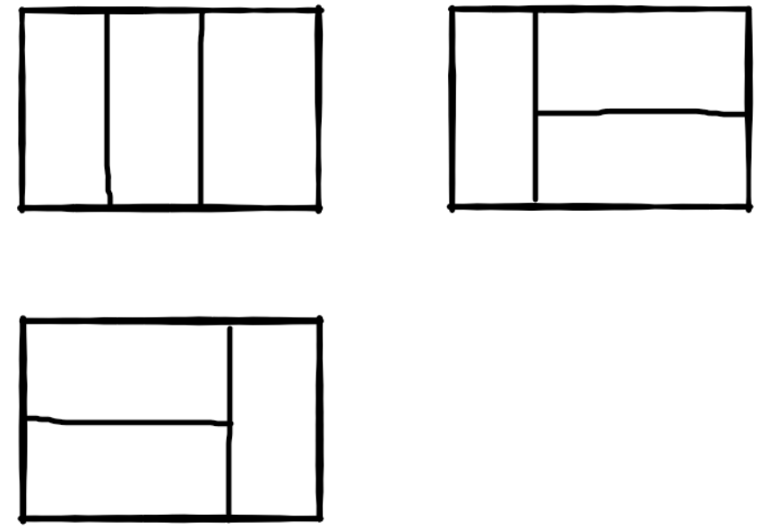
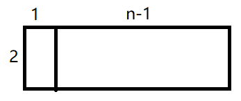
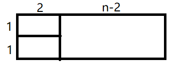

## 题目描述

我们可以用2\*1的小矩形横着或者竖着去覆盖更大的矩形。请问用n个2\*1的小矩形无重叠地覆盖一个2\*n的大矩形，总共有多少种方法？

比如n=3时，2*3的矩形块有3种覆盖方法：



* 测试代码

  ```java
  @Test
  public void test_rectCover(){
      int n1 = 3, n2 = 4, n3 = 5, n4 = 6;
      System.out.println("dfs_3:\t"+rectCover_dfs(n1));//3
      System.out.println("dp_4:\t"+rectCover_dp(n2));//5
      System.out.println("best_5:\t"+rectCover_best(n3));//8
      System.out.println("best_6:\t"+rectCover_math(n4));//13
  }
  ```

  

## 解题思路

换汤不换药，思路和青蛙跳台阶是一样的。`2*n`的大矩形可以由两种方式堆积而成：

* 最左侧使用一个`2*1`的矩形，接着堆积``2*(n-1)``的矩形

  

* 最左侧叠着两个`1*2`的矩形，接着堆积``2*(n-2)``的矩形

  

设2\*n的大矩形的叠法为`f(n)`，那么根据这个思路有：$f(n)=f(n-1)+f(n-2), f(1)=1,f(2)=2$

于是本题目变成了求斐波那契数列的第n项。

### 1、递归或循环解法

* 直接递归。时间、空间复杂度$$O(2^n)、O(1)$$

  ```java
  public int rectCover_dfs(int n){
      if(n < 1) throw new RuntimeException("input can't be less than 1");
      if(n < 3) return n;
      return rectCover_dfs(n-1)+rectCover_dfs(n-2);
  }
  ```

* 动态规划。时间、空间复杂度$$O(n)、O(n)$$

  ```java
  public int rectCover_dp(int n){
      if(n < 1) throw new RuntimeException("input can't be less than 1");
      if(n < 3) return n;
      int[] arr = new int[n];
      arr[0] = 1;
      arr[1] = 2;
      for(int i = 2; i < n; i++){
          arr[i] = arr[i-1] + arr[i-2];
      }
      return arr[n-1];
  }
  ```
  
* **推荐：**使用两个数字。时间、空间复杂度$$O(n)、O(1)$$

  ```java
  public int rectCover_best(int n){
      if(n < 1) throw new RuntimeException("input can't be less than 1");
      if(n < 3) return n;
      int a = 1, b = 2;
      while(--n > 1){//n=3时循环1次
          b = a + b;
          a = b - a;
      }
      return b;
  }
  ```

  

### 2、矩阵形式

斐波那契数列的矩阵形式：

$$\left[ \begin{matrix} f(n+1) \\ f(n) \end{matrix} \right] = \left[ \begin{matrix} 1 & 1 \\ 1 & 0 \end{matrix} \right]*\left[ \begin{matrix} f(n) \\ f(n-1) \end{matrix} \right] = {\left[ \begin{matrix} 1 & 1 \\ 1 & 0 \end{matrix} \right]}^n*\left[ \begin{matrix} f(1) \\ f(0) \end{matrix} \right]$$

设$A = \left[ \begin{matrix} 1 & 1 \\ 1 & 0 \end{matrix} \right]$，则$A^{2m}=[A^m]^2、A^{2m+1}=A*[A^m]^2$

* 使用矩阵来解题。时间、空间复杂度$$O(logn)、O(2^n)$$

  ```java
  public int rectCover_matrix(int n){
      if(n < 1) throw new RuntimeException("input can't be less than 1");
      if(n < 3) return n;
      return matrix_dfs_10(n)[1][0];
  }
  public int[][] A = {{1,1},{1,0}};
  public int[][] matrix_dfs_10(int n){
      if(n == 1) return A;
      int t = n >> 1;
      int[][] res = matrix_multiply_10(matrix_dfs_10(t), matrix_dfs_10(t));
      return (n & 1) == 0 ? res : matrix_multiply_10(A, res);
  }
  public int[][] matrix_multiply_10(int[][] a, int[][]b){
      int r = a.length, c = b[0].length, s = b.length;
      int[][] res = new int[r][c];
      for(int k=0; k<s; k++){
          for(int i=0; i<r; i++){
              for(int j=0; j<c; j++){
                  res[i][j] = a[i][k]*b[k][j];
              }      
          }
      }
      return res;
  }
  ```

### 3、数学公式

斐波那契数列第n项数学公式为：

$f(n) = \frac{(\frac{1+\sqrt{5}}{2})^{n+1}-(\frac{1-\sqrt{5}}{2})^{n+1}}{\sqrt{5}}$

这里$f(1)=1,f(2)=2$

* 数学公式解题。

  ```java
  public int rectCover_math(int n){
      if(n < 1) throw new RuntimeException("input can't be less than 1");
      double a = Math.sqrt(5);
      double b = Math.pow((1+a)/2, n+1), c = Math.pow((1-a)/2, n+1);
      return (int)((b-c)/a);
  }
  ```

  