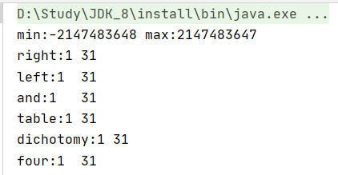
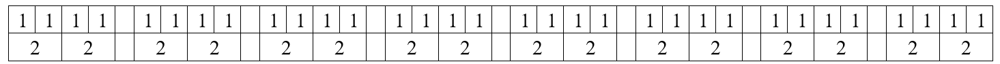
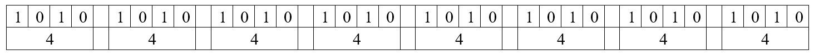
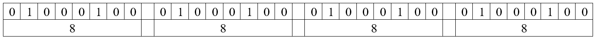
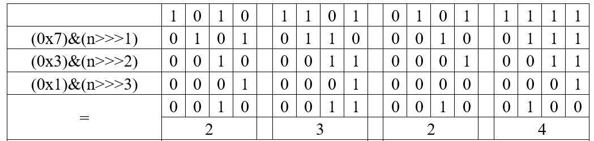
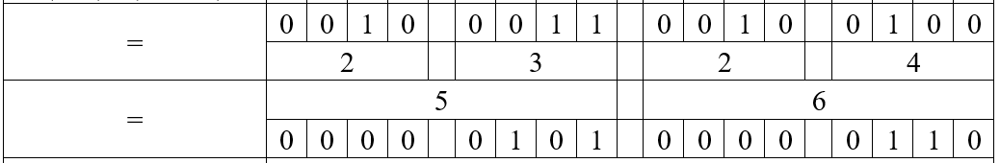
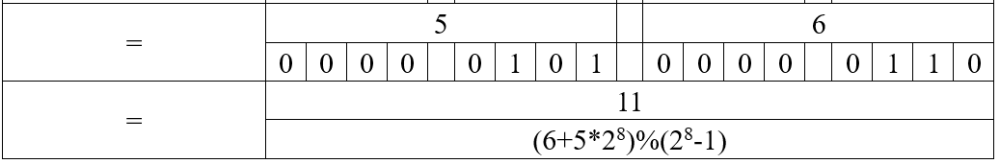

原文参考：https://blog.csdn.net/qq_16836151/article/details/51227168

## 题目描述

输入一个整数，输出该数32位二进制表示中1的个数。其中负数用补码表示。

* 测试代码

  ```java
  @Test
  public void test_numberOf1(){
      //-0表示最小值，其补码只有1个1; 2^31-1表示最大值，有31个1(符号位为0)
      int min = Integer.MIN_VALUE, max =  Integer.MAX_VALUE;
      System.out.println("min:"+min+"\tmax:"+max);
      System.out.println("right:"+numberOf1_right(min)+"\t"+numberOf1_right(max));
      System.out.println("left:"+numberOf1_left(min)+"\t"+numberOf1_left(max));
      System.out.println("and:"+numberOf1_and(min)+"\t"+numberOf1_and(max));
      System.out.println("table:"+numberOf1_table(min)+"\t"+numberOf1_table(max));
      System.out.println("dichotomy:"+numberOf1_dichotomy(min) + "\t"+numberOf1_dichotomy(max));
      System.out.println("four:"+numberOf1_four(min)+"\t"+numberOf1_four(max));
  }
  ```

  

## 解题思路

由于算术右移中，负数会补1，因此可以考虑使用逻辑右移`>>>`。

该题目总共有以下几种思路（时间、空间复杂度中的`N=32`）

* 直接算数右移求解：使用计数器统计每次右移前的最右边的数字。时间、空间复杂度$O(N)、O(1)$

  ```java
  public int numberOf1_right(int n){
      int cnt = 0;
      while(n != 0){
          cnt += (n & 1);
          n = n >>> 1;
      }
      return cnt;
  }
  ```

* 直接左移求解：设置`flag=1`，将其不断左移得到数字`n`的每一位的数字。时间、空间复杂度$O(N)、O(1)$

  ```java
  public int numberOf1_left(int n){
      int flag=1, cnt = 0;
      while(flag != 0){
          if((flag & n) != 0) cnt++;
          flag <<= 1;
      }
      return cnt;
  }
  ```

* 利用特性：`n&(n-1)`可以消除最右边的一个1，如`n=1110,n&(n-1)=1100;  n=0101,n&(n-1)=0100`。时间、空间复杂度$O(N)、O(1)$

  ```java
  public int numberOf1_and(int n){
      int cnt = 0;
      for(; n != 0; cnt++){
          n = (n & (n-1));
      }
      return cnt;
  }
  ```

* 查表法：题目是32位，可以切分为8个4位，对每个4位的`[0-15]`数字之间建立一个表格，表格中存储对应数字中1的个数，如`table[2]=1、table[5]=2`。时间、空间复杂度$O(N)、O(1)$

  ```java
  public int numberOf1_table(int n){
      int[] table = new int[16];//15个数字
      table[0] = 0;
      //对于数字n，需要区分奇偶性：
      //n为偶数时，table[4]=table[2]=table[1],即偶数都是由1左移而来，1的个数始终保持为1
      //n为奇数时，table[2m+1] = table[2m] + 1,即奇数n中1的个数等于偶数(n-1)中1的个数加1
      for(int i = 1; i < 16; i++){
          table[i] = table[i>>1] + (i & 1);
      }
      int cnt = 0;
      while(n != 0){
          cnt += table[n & 15];
          n = n >>> 4;//无符号左移
      }
      return cnt;
  }
  ```

* 平行法：时间、空间复杂度$O(logN)、O(1)$。将数字n显示为32位二进制数字，接着进行如下操作：

  1. 将二进制中相邻的两位数字进行相加，得到的结果即为16个两位数字中1的个数，设中间变量`temp1 = 0b0101 0101 0101 0101 0101 0101 0101 0101`，那么这一步可以通过`(n&temp1) + ((n>>>1)&temp1)`计算得到。将`temp1`写成十六进制即为`temp1 = 0x55555555`。

     

  2. 用n表示1的个数，此时有16个2位的数字需要相加。此时需要将之前两位的数字继续进行相邻相加。设中间变量`temp2 = 0b0011 0011 0011 0011 0011 0011 0011 0011`，则这一步可以通过`(n&temp2) + ((n>>2)&temp2)`计算得到。将`temp2`写成十六进制即为`temp2 = 0x33333333`。

     

  3. 继续使用n表示计算的结果，此时有8个4位的数字需要相加，依然采用两两相加的原则。设中间变量`temp3 = 0b00001111 00001111 00001111 00001111`，则这一步可以通过`(n&temp3) + ((n>>>4)&temp3)`计算得到。将`temp3`写成十六进制即为`temp3 = 0x0f0f0f0f`。

     

  4. 继续使用n表示计算的结果，此时有4个8位的数字需要相加，依然采用两两相加的原则。设中间变量`temp4 = 0b00000000 11111111 00000000 11111111`，则这一步可以通过`(n&temp4) + ((n>>>8)&temp4)`计算得到。将`temp4`写成十六进制即为`temp4 = 0x00ff00ff`。

     

  5. 继续使用n表示计算的结果，此时有2个16位的数字需要相加，依然采用两两相加的原则。设中间变量`temp5 = 0b00000000 00000000 11111111 11111111`，则这一步可以通过`n&temp5+(n>>>16)&temp5`计算得到。将`temp5`写成十六进制即为`temp5 = 0x0000ffff`。

  ```java
  public int numberOf1_dichotomy(int n){
      int temp1 = 0x55555555, temp2 = 0x33333333, temp3 = 0x0f0f0f0f;
    int temp4 = 0x00ff00ff, temp5 = 0x0000ffff;
      n = (n&temp1)+((n>>>1)&temp1);
      n = (n&temp2)+((n>>>2)&temp2);
      n = (n&temp3)+((n>>>4)&temp3);
      n = (n&temp4)+((n>>>8)&temp4);
      n = (n&temp5)+((n>>>16)&temp5);
      return n;
  }
  ```
  
* 快速法：时间、空间复杂度$O(N)、O(1)$。该方法根据进制之间的转换巧妙解题。主要分为以下几步：

  1. 将16进制的数字表示为$n_0=2^3a+2^2b+2^1c+2^0d=8a+4b+2c+d$，其中，`a、b、c、d`分别表示对应位的数字。那么将其无符号右移一位可以得到$n_1=4a+2b+c$，右移两位可以得到$n_2=2a+b$，右移三位可以得到$n_3=a$。于是可以得到公式：$sum=n_0-n_1-n_2-n_3=a+b+c+d$。不难看出`sum`就是这个16进制数中1的个数。

     

  2. 将32位的数字拆分为8个4位的数字，分别计算每个4位数字中1的个数，将结果复制给n。此时可以将n的二进制数值中相邻的4位数字进行相加，可以得到4个8位数字。参照平行法中的方法，可以通过`(n + (n>>>4))&(0x0f0f0f0f)`计算得出（如下，16位可以得到2个8位的数字）。

     

     

  3. 4个8位的数字可以通过取余操作得到结果。

     

  ```java
  public int numberOf1_four(int n){
      n = n - ((n>>>1)&(0x77777777)) - ((n>>>2)&(0x33333333)) - ((n>>>3)&(0x11111111));
      return ((n + (n>>>4))&(0x0f0f0f0f))%255;
  }
  ```
