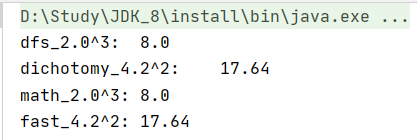

## 题目描述

给定一个double类型的浮点数base和int类型的整数exponent。求base的exponent次方。

保证base和exponent不同时为0

### 示例1

输入

```
2,3
```

返回值

```
8.00000
```

* 测试代码

  ```java
  @Test
  public void test_power(){
      double b1 = 2.0, b2 = 4.2;
      int e1 = 3, e2 = 2;
      System.out.println("dfs_2.0^3:\t"+power_dfs(b1, e1));
      System.out.println("dichotomy_4.2^2:\t"+power_dichotomy(b2, e2));
      System.out.println("math_2.0^3:\t"+power_math(b1, e1));
      System.out.println("fast_4.2^2:\t"+power_fast(b2, e2));
  }
  ```

  

## 解题思路

由于要求double类型的整数次方，因此本题目有以下几种解法（时间、空间复杂度中的`N=exponent`）

* 直接递归。考虑特殊情况：两者同时为0，泡池异常；指数为0，递归的出口；指数为负数，$x^{-n}=\frac{1}{x^n}$。递归计算时，每一次都乘以基数`base`。时间、空间复杂度$O(N)、O(1)$

  ```java
  public double power_dfs(double base, int exponent){
      if(base == 0 && exponent == 0) throw new RuntimeException("input is illegal");
      if(exponent == 0) return 1.0;
      if(exponent < 0) return 1.0/power_dfs(base, -exponent);
      return base*power_dfs(base, exponent-1);
  }
  ```

* 二分递归。根据指数的奇偶性：$x^{2m}=x^m*x^m、x^{2m+1}=x*x^m*x^m$。时间、空间复杂度$O(logN)、O(logN)$

  ```java
  public double power_dichotomy(double base, int exponent){
      if(base == 0 && exponent == 0) throw new RuntimeException("input is illegal");
      if(exponent == 0) return 1.0;
      if(exponent < 0) return 1.0/power_dfs(base, -exponent);
      int temp = exponent >> 1;//每次递归都要记住这个变量，因此需要占用空间
      double sum = power_dichotomy(base, temp) * power_dichotomy(base, temp);
      return ((exponent & 1) == 0) ? sum : sum*base;
  }
  ```


* `Math.pow`函数。

  ```java
  public double power_math(double base, int exponent){
      if(base == 0 && exponent == 0) throw new RuntimeException("input is illegal");
      return Math.pow(base, exponent);
  }
  ```

* 快速幂算法：每一步都把指数分成两半，而相应的底数做平方运算。如$6=0b110=2^1+2^2, x^6=x^{2^1}*x^{2^2}$、$7=0b111=2^0+2^1+2^2, x^7=x^{2^0}*x^{2^1}*x^{2^2}$。该方法相当于遍历了指数exponent的二进制位，时间、空间复杂度$O(logN)、O(1)$

  ```java
  public double power_fast(double base, int exponent){
      if(base == 0 && exponent == 0) throw new RuntimeException("input is illegal");
      if(exponent == 0) return 1.0;
      if(exponent < 0) return 1.0/power_dfs(base, -exponent);
      double sum = 1.0;
      while(exponent != 0){
          if((exponent & 1) == 1) sum *= base;
          exponent = exponent >> 1;
          base = base * base;
      }
      return sum;
  }
  ```

  