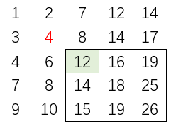
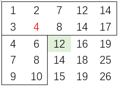

## 题目描述

在一个二维数组中（每个一维数组的长度相同），每一行都按照从左到右递增的顺序排序，每一列都按照从上到下递增的顺序排序。请完成一个函数，输入这样的一个二维数组和一个整数，判断数组中是否含有该整数。

* 测试输入与输出：

  ```
  1 2	7 12  14
  3	4	8 14  17	
  4	6	12  16  19
  7	8	14  18  25
  9	10  15  19  26
  
  input1:	4	output1: true
  input2: 20	output2: false
  ```

* 测试代码

  ```java
  @Test
  public void test_1(){
      int [][] array = {{1,2,7,12,14},{3,4,8,14,17},{4,6,12,16,19},{7,8,14,18,25},{9,10,15,19,26}};
      int target1 = 4, target2 = 20;
      boolean f = dfs_1_2(0,0,array.length-1, array[0].length-1,array, target);
      System.out.println(f);
  }
  ```

  

## 解题思路

根据题意，每行每列数字大小递增（假设有`m`行`n`列），要想找到target值，那么将会有下面几种思路：

* 假如从数组的左上角开始进行查找，那么**该数字下边或者右边的数字都比它大，此处将会出现岔路**，同理，从数组的右下角开始进行查找也会出现岔路。此时，如果将整个数组遍历，时间复杂度将达到`O(mn)`，因此可以考虑引入二分的思路，按照**逐行二分或者逐列二分进行解题**，时间复杂度为`O(nlog(m))`或者`O(mlog(n))`

* 假如从数组的左下角进行查找，如果target比该元素大，那么往右边移动；如果target比该元素小，那么往上边移动，这样确保**每次都只会朝着一个方向移动**，同理，从数组的右上角进行查找亦可解题，时间复杂度为`O(m+n)`。该思路可以使用递归、循环等解法。

* 假如使用二分法进行查找，那么第一个比较的元素位于($\frac{m-1} {2}$,$\frac{n-1} {2}$)，此时其左上角区域的所有元素比它小，其右下角区域的所有元素比它大，因此每一次和target作比较后，只去掉其右下角或者左上角的区域。

### 1、左上角或右下角开始查找

* 整个数组遍历，时间复杂度`O(mn)`

  ```java
      public boolean for_1(int [][] array, int target){
          //边界条件判断
          if (array == null || array.length == 0 || array[0] == null || array[0].length == 0)
              return false;
          //整个数组循环
          for(int row = 0; row < array.length; row++){
              for(int col = 0; col < array[0].length; col++)
                  if(array[row][col] == target) return true;
          }
          return false;
      }
  ```

  

* 逐行二分或者逐列二分，时间复杂度`O(nlog(m))`

  ```java
      public boolean for_1_2(int [][] array, int target){
          //边界条件判断
          if (array == null || array.length == 0 || array[0] == null || array[0].length == 0)
              return false;
          for(int row = 0; row < array.length; row++){
              //此处需要导包，import java.util.Arrays;
              //由于每一行都已经排好序了，因此可以使用Arrays.binarySearch
              if(Arrays.binarySearch(array[row], target) >= 0) return true;
          }
          return false;
      }
  ```

### 2、左下角或右上角开始查找

* 递归解法，从右上角

  ```java
      //递归解法：从右上角
      public boolean dfs_1(int row, int col, int [][] array, int target){
          //边界条件：超出数组的范围
          if(col < 0 || row >= array.length) return false;
          //开始判断：和当前元素相等，直接返回；比当前元素小，左移，即col-1；比当前元素大，下移，即row+1
          if(array[row][col] == target) return true;
          else if(target < array[row][col]) return dfs_1(row, col-1, array, target);
          else return dfs_1(row+1, col, array, target);
      }
  ```

  

* 循环解法，从左下角

  ```Java
  	//循环解法：从左下角
      public boolean for_2(int [][] array, int target){
          int row = array.length-1, col = 0;
          while(row >= 0 && col < array[0].length){
              if(array[row][col] == target) return true;
              else if(target < array[row][col]) row--;
              else col++;
          }
          return false;
      }
  ```


### 3、二分查找

* 递归解法。假设在测试的矩阵中寻找数字`target = 4`。

  ——第一步则是取出矩阵中最中间的元素`12`，通过对比可以发现`target`比该元素比小，因此需要舍弃包括该元素的右下角区域（下图中框体部分）。
  
  
  
  ——第二步返回该元素左下角和整个上方区域的元素（下图中框体部分）。代码中使用`(row,col)`表示当前元素、`(left_row,left_col, right_row,right_col)`表示整个矩形的左上角和右下角坐标，那么
  
  ​		* 该元素左下角区域可表示为`(row,left_col, right_row,col-1)`
  
  ​		* 该元素整个上方区域可表示为`(left_row,left_col, row-1,right_col)`
  
  
  
  ```Java
  	public boolean binary_find(int left_row, int left_col, int right_row, int right_col, int target, int [][] array){
          //递归的边界条件
          if(left_row > right_row || left_col > right_col) return false;
          //确定中间元素的索引
          int row = (left_row + right_row) >> 1, col = (left_col + right_col) >> 1;
  		//开始判断
          if(target == array[row][col]) return true;
        else if(target > array[row][col]){
              //target比当前元素大，则查找其右上角和整个下方区域的元素
              return binary_find(left_row, col+1, row, right_col, target, array) ||
                  binary_find(row+1, left_col, right_row, right_col, target, array);
          }
          else{
              //target比当前元素小，则查找其左下角和整个上方区域的元素
              return binary_find(row, left_col, right_row,col-1, target, array) ||
                  binary_find(left_row, left_col, row-1, col, target, array);
          }
      }
  ```
  
  
