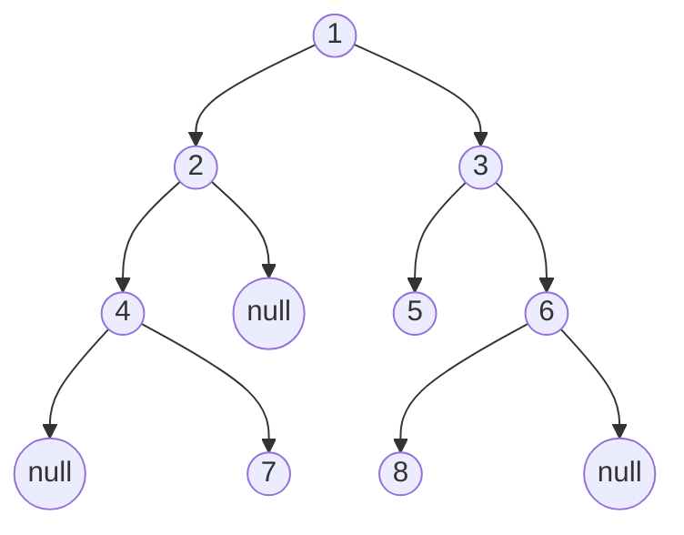

## 题目描述

输入某二叉树的前序遍历和中序遍历的结果，请重建出该二叉树。假设输入的前序遍历和中序遍历的结果中都不含重复的数字。例如输入前序遍历序列{1,2,4,7,3,5,6,8}和中序遍历序列{4,7,2,1,5,3,8,6}，则重建二叉树并返回。




## 解题思路

根据二叉树的特点，可以重复以下步骤：

* 通过前序遍历来找到当前二叉树的根节点；
* 在中序遍历中寻找根节点，以根节点为分界线将序列分为左子树的中序序列和右子树中序序列；
* 结合左右子树中序序列的长度，将前序序列分为左子树的前序序列和右子树的前序序列；
* 根据左子树的前序和中序序列、右子树的前序和中序序列，重复第一步。

### 1、递归解法

* 测试代码

  ```Java
  //定义树的结构
  public class TreeNode {
      int val;
      TreeNode left;
      TreeNode right;
      TreeNode(int x) { val = x; }
  }
  //树的后序遍历
  public void next_recursion(TreeNode root){
      if(root == null) return;
      next_recursion(root.left);
      next_recursion(root.right);
      System.out.print(root.val+"\t");
  }
  @Test
  public void test_dfs(){
      int [] pre={1,2,4,7,3,5,6,8}, in = {4,7,2,1,5,3,8,6};
      //根据前序和中序来重构二叉树
      TreeNode root_dfs = BT_dfs(pre, 0, pre.length-1, in, 0, in.length-1);
      TreeNode root_copy = BT_copy(pre, in);
      //测试重构二叉树的后序遍历
      System.out.println("dfs:");
      next_recursion(root_dfs);
      System.out.println("\ncopy:");
      next_recursion(root_copy);
  }
  ```

* 根据索引来确定当前树前序和中序的序列起止下标

  ```Java
  public TreeNode BT_dfs(int [] pre,int pre_l, int pre_r, int [] in,int in_l, int in_r) {
      if(pre_l > pre_r) return null;//递归出口
      TreeNode root = new TreeNode(pre[pre_l]);//根据前序序列获取当前树的根节点
      //in_root用于标记中序序列中根节点的索引
      int in_root = in_l;
      while(in[in_root] != pre[pre_l]) in_root++;
      //当前树的左子树长度为in_root-in_l
      root.left = BT_dfs(pre, pre_l+1, pre_l+in_root-in_l, in, in_l, in_root-1);
      root.right = BT_dfs(pre, pre_l+in_root-in_l+1, pre_r, in, in_root+1, in_r);
      return root;
  }
  ```

* 单独取出树的前序和中序序列

  ```Java
  //该方法需要导入包文件
  //import java.util.Arrays;
  public TreeNode BT_copy(int [] pre, int [] in){
  	if(pre.length <= 0) return null;
      TreeNode root = new TreeNode(pre[0]);
      int in_root = 0;
      while(in[in_root] != pre[0]) in_root++;
      root.left = BT_copy(Arrays.copyOfRange(pre, 1, in_root+1), Arrays.copyOfRange(in, 0, in_root));
      root.right = BT_copy(Arrays.copyOfRange(pre, in_root+1, pre.length), Arrays.copyOfRange(in, in_root+1, in.length));
      return root;
  }
  ```

  